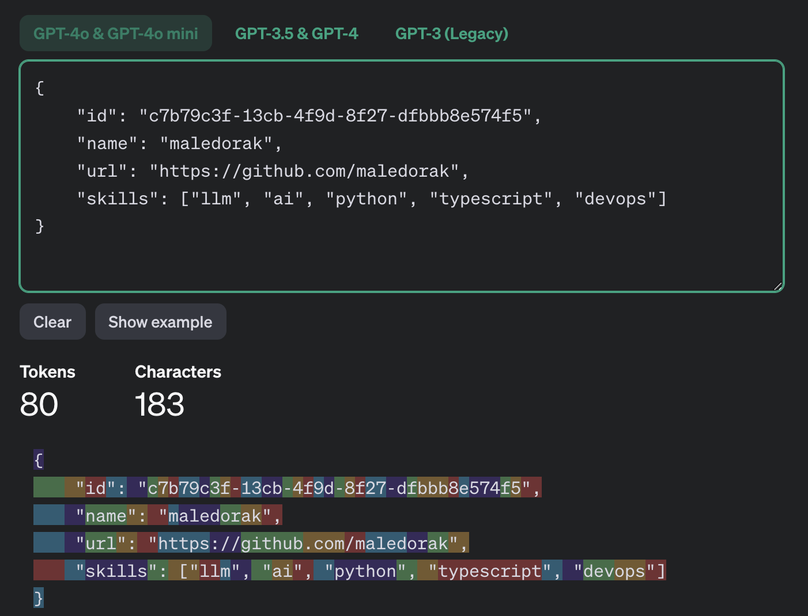
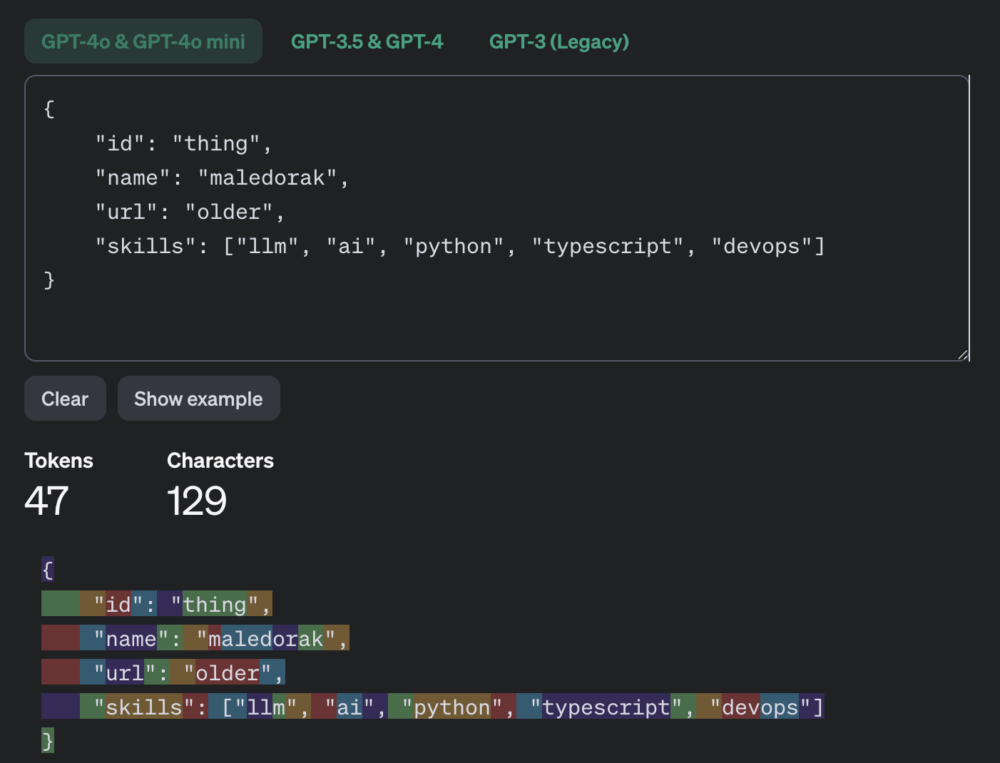

# Single token words

This project is to find all the words that can be encoded by a single token in different LLM tokenizers.

Useful if you want to map some large text chunks before sending to LLM.

## Why do we need this?

Sometimes you need to send a large structurized text to LLM, like JSON, HTML, etc.

In this case, often you don't need to encode the whole data, like IDs, html classes, html urls, etc. - This even can be harmful to your wallet and LLM performance!

You can just map this data to some single token words.

### Examples

Examples was used with [OpenAI Tokenizer](https://platform.openai.com/tokenizer).

#### JSON

**Note:** This is the token count of the full data:



**Note:** And this is the token count of the same data, but with mapped words:



**Note:** You can see that the token count is much less. Which on scale thousands of requests can save you a lot of money!

## How to use

Just copy the output files from [single_token_words](single_token_words) folder to your project and use them.

There are json and csv versions of the files.

In [single_token_words_info](single_token_words_info) folder you can find some info about the words.

### Python

You can make some simple class for getting unique single token words from the file and use it to map your data.

```python
from typing import List
import json

class SingleTokenWords:
    def __init__(self):
        self._words = set(self._load_words())

    def _load_words(self) -> List[str]:
        with open('single_token_words.json', 'r') as file:
            return json.load(file)
        
    def get_word(self) -> str:
        return self._words.pop()
```

## Supported languages

- English - based on [English-Valid-Words](https://github.com/Maximax67/English-Valid-Words) repository

## Supported tokenizers

- openai_tiktoken
    - cl100k_base (gpt-4, gpt-3.5-turbo)
    - o200k_base (gpt-4o, gpt-4o-mini, o1)

